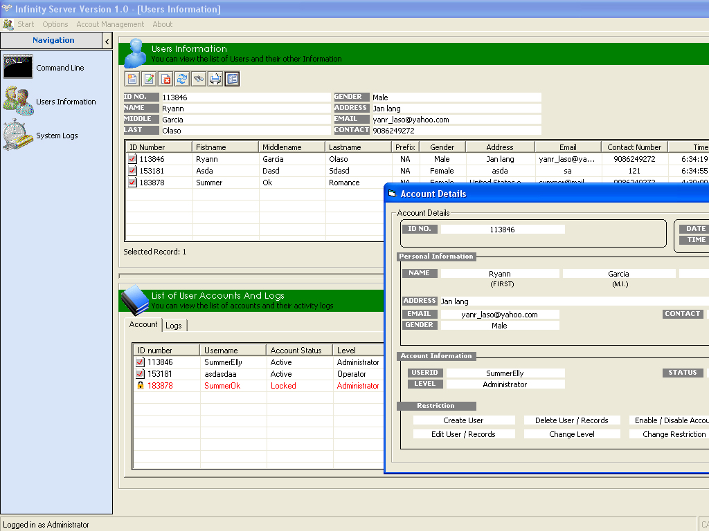



## Simple Login System \[UPDATED version\] 03/31/11

### Description

Allows users to learn how to connect to database and how to access data entries, add, delete.

how to call api, listview tricks etc.. please do rate my work, and please post some comment, thank you very much.

fix some bugs and added some new features
 
### More Info
 

             |
---                |---
**Submitted On**   |2011-03-31 20:44:36
**By**             |[SummerRomance](https://github.com/Planet-Source-Code/PSCIndex/blob/master/ByAuthor/summerromance.md)
**Level**          |Beginner
**User Rating**    |4.3 (17 globes from 4 users)
**Compatibility**  |VB 6\.0, VBA MS Access
**Category**       |[Complete Applications](https://github.com/Planet-Source-Code/PSCIndex/blob/master/ByCategory/complete-applications__1-27.md)
**World**          |[Visual Basic](https://github.com/Planet-Source-Code/PSCIndex/blob/master/ByWorld/visual-basic.md)
**Archive File**   |[Simple\_Log2201003312011\.zip](https://github.com/Planet-Source-Code/summerromance-simple-login-system-updated-version-03-31-11__1-73737/archive/master.zip)

